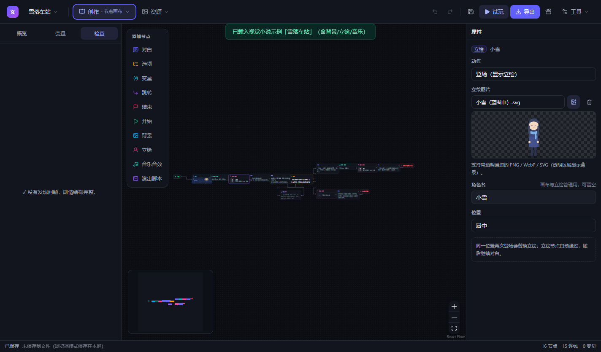
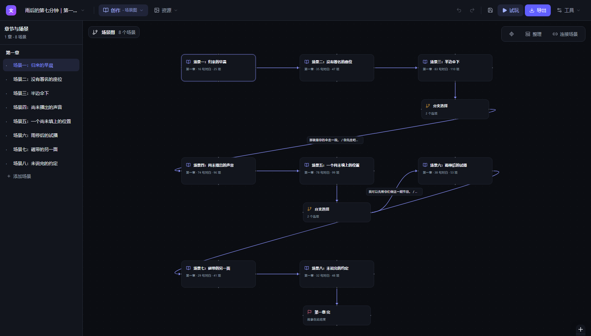
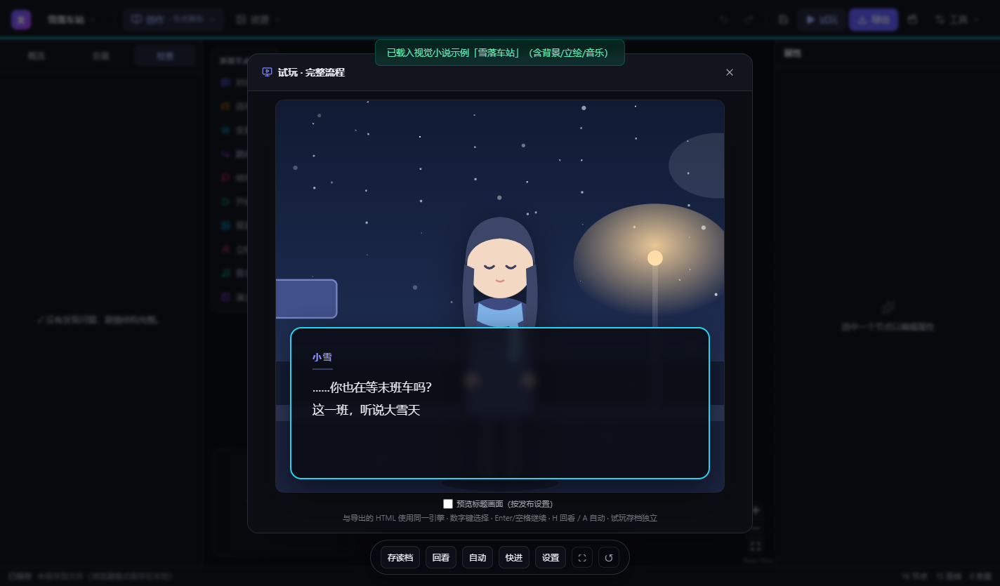
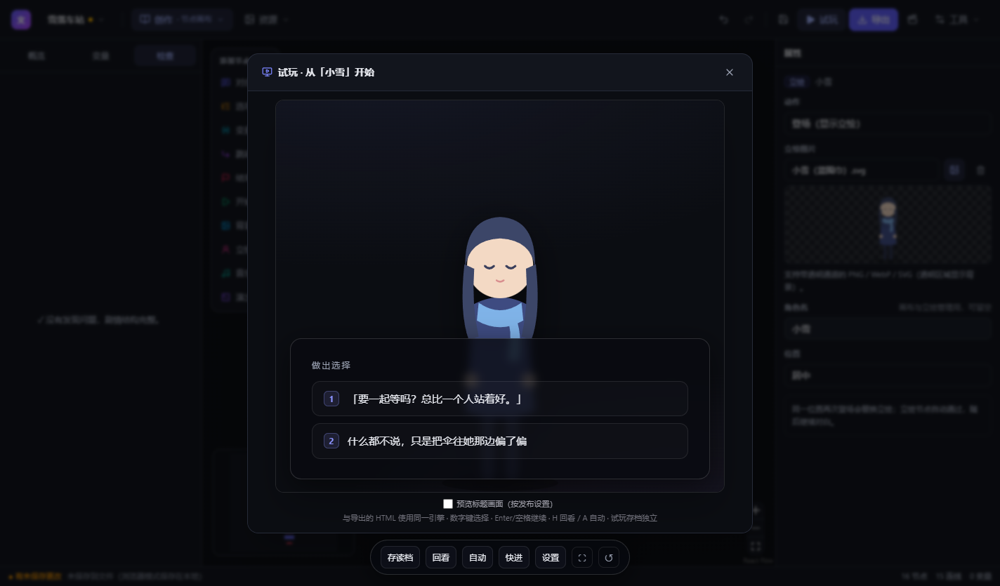
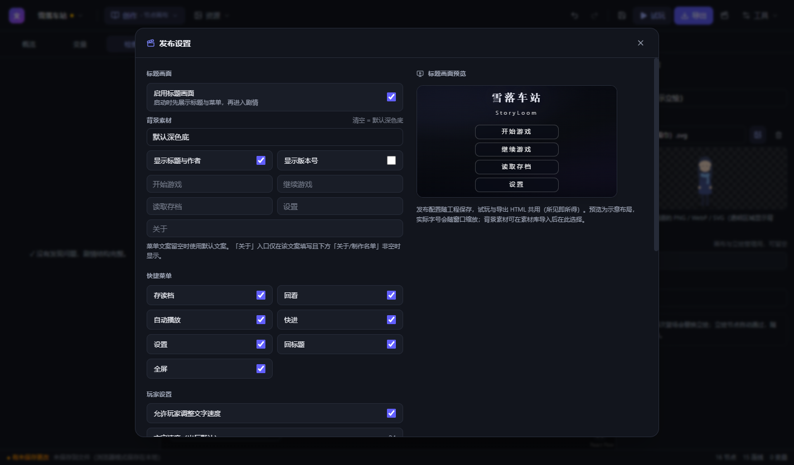

# FableLoom · 现代化文字游戏编辑器

一款专注于**分支叙事**的文字游戏（互动小说 / 文字冒险 / 视觉小说）编辑器。基于节点画布组织剧情，内置试玩引擎，可一键导出为**单文件 HTML 可玩成品**，提供**自定义演出接口**（脚本节点 / 自定义 CSS·JS / 文本标记）与**双面插件系统**（编辑器 + 作品）。

    

## 预览



<table>
  <tr>
    <td align="center"><br/><sub>场景图：章节、分支与多结局总览</sub></td>
    <td align="center"><br/><sub>内置试玩：视觉小说演出与插件皮肤</sub></td>
  </tr>
  <tr>
    <td align="center"><br/><sub>分支选项：选择决定走向与结局</sub></td>
    <td align="center"><br/><sub>发布设置：标题画面实时预览</sub></td>
  </tr>
</table>

## 下载

Windows 安装包与便携版见 [Releases](https://github.com/FanerJian/fableloom/releases/latest)：下载 `FableLoom-Setup-*.exe`（安装版）或 `FableLoom-Portable-*.exe`（免安装单文件）。Tauri Lite 版暂需从源码构建。

各版本变更见 [CHANGELOG.md](CHANGELOG.md)。

## 基础功能

- **节点画布**：十种节点——开始 / 对白 / 选项 / 变量 / 跳转 / 结束 + 视觉小说演出三件套（**背景 / 立绘 / 音乐音效**）+ **演出脚本**（自定义效果 API）；拖拽连线即剧情流向；小地图、框选、自动整理布局（elkjs）
- **视觉小说演出**：背景铺满（交叉淡化切换）、立绘三槽位登场退场 + **自定义水平位置**（0-100% 滑杆 / `api.sprite` 的 `x` 参数 / Yarn `x30` 命令，改位平滑滑动；支持带透明通道的 PNG/WebP/SVG）、BGM/SFX；含媒体/脚本节点的故事自动切换为「贴底对白卡」布局
- **自定义演出接口**：见下节
- **插件系统**：见下节
- **窗口**：自由缩放、记住尺寸/位置/最大化状态、恢复时钳回现有屏幕工作区、F11 全屏；作品播放器内置 ⛶ 全屏按钮
- **素材**：团队目录工程使用外部文件，单文件模式仍以 data URL 内嵌；按 SHA-256 去重。播放器预加载当前与相邻场景的少量图片，最多 8 张、已知文件大小合计 20MB；音频按播放需要读取
- **变量与条件**：全局变量（数字/文本/真假），选项可设显示条件，变量节点支持 设为/加/减
- **实时校验**：断头剧情、不可达节点、未定义变量、素材缺失等问题在「检查」面板列出，点击跳转
- **试玩与播放器**：同一引擎，支持「从选中节点开始试玩」，数字键 1-9 选择、Enter/点击画面继续；文本回看、6 个存档槽位、自动播放及全局文字速度（内联 `{speed}` 优先）
- **导出**：单文件 HTML（运行时内联 + 剧情与素材注入）；**Yarn 脚本**、**Ink 脚本**（Ink 为实用子集）
- **导入**：打开 `.story.json` 或直接导入 `.yarn` / `.ink` 脚本（媒体命令与效果命令在 Yarn 中往返保留；Ink 导出多媒体/演出为注释）
- **工程文件**：v4 支持 `.story.json` 与 `.loomproject` 目录工程，兼容读取 v1/v2/v3；自动保存、最近文件、撤销/重做，未保存工程也有恢复快照。目录工程按场景增量保存并保护外部修改
- **深浅色主题**、中文界面、内置两个示例工程（文字冒险「翡翠旅店的夜晚」/ 视觉小说「雪落车站」含演出脚本演示）

## 播放器与恢复

- **存读档**：单文件 HTML 使用浏览器 localStorage 存 6 个槽位，记录变量、稳定剧情节点、回看、背景、立绘、BGM 位置及运行时样式。试玩使用独立命名空间。只保存素材引用，不复制 base64；作品内容变更时旧档标为不兼容，避免载入已改变的剧情。
- **安全时点**：在普通对白、选项和结局存档。脚本执行或 `api.say()` 等待期间禁用存档，因为任意 JavaScript 的调用栈无法序列化；读档不重放已执行的变量或演出节点。
- **自动与字速**：H 打开回看（最近 500 条），A 切换自动；自动播放在文字显示完成后推进，遇到选项停止推进；打开回看/存档/设置时暂停。默认每字 24ms，0 为立即显示，`{speed}` 标记覆盖全局值。重启、读档和关闭试玩会取消旧打字机与旧脚本的后续写入。
- **存储限制**：存档属于当前浏览器/用户配置，不自动跨设备同步；移动或更换浏览器打开 HTML 时可能使用不同存储。隐私策略或存储额度限制不会中断游玩，播放器会显示存储不可用/写入失败。
- **崩溃恢复**：Electron 写入 `userData/recovery/`，Tauri 写入 appData，浏览器调试使用 IndexedDB。编辑后约 1.5 秒防抖，并以 15 秒周期兜底；每个工程独立快照，恢复后仍带未保存标记。保留的快照直到人工保存或明确丢弃才删除。
- **首屏与加固**：欢迎页按需加载编辑器、试玩及示例/导出模块；ELK 仍只在自动布局时加载。发布版 CSP 限制网络连接，开发模式仅额外允许本机 HMR；自定义脚本保留 `unsafe-eval` 支持。

## 自定义演出接口

三种粒度，全部对**试玩与导出 HTML 同效**（工具栏 `{}` 按钮内有完整接口文档）：

**1. 演出脚本节点**：画布中添加「演出脚本」节点，写一段可 `await` 的 JS，运行时自动通过。入参 `api` / `vars` / `story`：

```js
await api.flash('#dfe8ff', 260)   // 闪光
await api.shake(7, 500)           // 震屏
await api.wait(200)
await api.say('小雪', '……你听到了吗？')  // 脚本内连续演出对白
vars.好感 = (vars.好感 ?? 0) + 1    // 直接读写变量
await api.fadeOut('#000', 600)    // 黑场转场
await api.fadeIn(600)
api.bg('雪夜车站.svg', { fade: 500 })    // 按素材名切换背景（交叉淡化）
api.sprite('小雪.svg', 'left'); api.hideSprite('center')
api.bgm('晚安小调.wav', { volume: 40 }); api.sfx('风铃.wav')
api.setStyle('.tgr-card', 'background: rgba(20,10,30,.9)')  // 动态样式
api.goto('第三章')                 // 跳到指定名称的跳转点/结局
```

**2. 工程级自定义 CSS / JS**：工具栏 `{}` → 自定义 CSS（覆盖运行时样式，`.tgr-card` / `.tgr-speaker` / `.tgr-text` / `.tgr-stage` …）与自定义 JS（游戏开始时执行一次，同一套 api）。

**3. 对白内联文本标记**（对白与 `api.say` 文本均可用）：

```
{color:#ff6b6b}红色文字{/color}   {size:120%}放大{/size}   {b}加粗{/b} {i}斜体{/i}
{speed:24}打字机模式（ms/字）{/speed}   {pause:500}此处停顿   {{ 输出字面「{」
```

**Yarn 互通**：演出脚本导出为效果命令 `<<shake>>` / `<<flash>>` / `<<fadeout>>` / `<<fadein>>` / `<<wait 500>>`，其余代码行为 `<<js …>>`；导入时这些命令（以及其他运行时的未知命令）自动恢复为演出脚本节点。Ink 中演出导出为注释。

## 插件系统

一个插件 = 一个 JSON 文件（`.loomplugin`），可同时携带**两个作用面**的代码；工具栏插头按钮 / 视图菜单（Ctrl+Alt+P）打开「插件管理」，安装后勾选即生效：

| 字段 | 作用面 | 注入位置 |
|---|---|---|
| `editorCss` / `editorJs` | 编辑器 | 主窗口（换肤、扩展编辑器行为） |
| `runtimeCss` / `runtimeJs` | 作品 | 试玩 + 导出的单文件 HTML（演出与外观） |

```json
{
  "id": "my-skin", "name": "我的主题", "version": "1.0.0",
  "author": "", "description": "",
  "apiVersion": 1,
  "editorCss": "/* 编辑器换肤 */", "editorJs": "/* 可用 window.FableLoom */",
  "runtimeCss": "/* 作品换肤 */", "runtimeJs": "/* 演出脚本，可用 api / vars / story */"
}
```

- **editorJs 上下文**（`window.FableLoom`，apiVersion 1 内保证稳定）：`project.get()/getState()/subscribe(cb)`、`ui.openPlaytest()/openCustom()/openPlugins()`、`toast.*`、`version`
- **runtimeJs** 与演出脚本节点同环境（`api.say/shake/…`），与工程 customJs 依次执行
- 示例见 `examples/plugins/`（墨韵纸面主题：双端换肤；剧场宽幅模式：runtimeJs 动态样式）

**兼容性设计**：`apiVersion` 不匹配的插件拒绝载入并明确报错；解析器对缺省字段全部兜底（旧插件向前兼容）；插件 API 面刻意收窄（editorJs 只承诺 `window.FableLoom`，底层 store 结构不属于承诺范围）；插件注入失败只报错不停机。工程本身不依赖插件——卸载后试玩/导出立即回到原生形态。

## 编辑器的上限（如实说）

- **运行时**是单线性状态机 + 效果 API：工程为 v4，玩家存档仍是独立的 v1；结构化并行演出/定时分支、跨作品进度与任意脚本执行栈恢复仍未支持
- **编辑器插件**不能注册自定义 UI（工具栏按钮/面板）；能改样式、读工程、调 toast 和打开面板，行为扩展有边界
- **单文件模式**仍将素材 base64 写进 JSON，较大作品建议使用已实现的团队目录模式；真实高分辨率图片与长配音的解码、内存表现仍需专门测量
- **导出形态**是单 HTML：无多文件资源缓存、无移动端适配、无 Steam/itch 包装
- 插件 JS 与主程序同权限运行（无沙箱）——只安装可信来源的插件

## 两种交付形态

| | Electron 版 | Tauri Lite 版 |
|---|---|---|
| 安装包 | ~98 MB | ~10 MB 量级 |
| 获取 | [Releases](https://github.com/FanerJian/fableloom/releases) 提供 Setup / Portable 下载 | 从源码构建（`npm run build:tauri`，需 Rust stable-msvc） |
| 说明 | 功能完全体 | 同一渲染层 + Rust 壳，文件对话框/读写走 Tauri 插件 |

两个版本共用同一套 React 渲染层与可玩运行时，编辑器功能一致。

## 开发

```bash
npm install          # 建议 ELECTRON_MIRROR=https://npmmirror.com/mirrors/electron/
npm run dev          # Electron 开发模式（HMR）
npm run dev:web      # 纯浏览器调试（localStorage 回退）
npm run test:io      # Ink/Yarn 导入导出回环测试（esbuild + node）
npm run test:core    # 恢复、素材去重、播放器存档与窗口边界回归
npm run typecheck    # 类型检查
npm run build        # 构建运行时与 Electron 三层
npm run test:app     # 隐藏 Electron 验证恢复、首屏、CSP 与试玩（需先 build）
npm run test:player-dom # 隐藏 Electron 验证玩家交互与单 HTML 重载读档
npm run test:browser-recovery # 无宿主桥的纯浏览器 IndexedDB 恢复实测（需先 build:web）
npm run build:win    # 打包 Electron 安装包与便携版（dist/）
npm run build:tauri  # 打包 Tauri Lite（需 Rust stable-msvc；src-tauri/）
```

## 结构

```
src/main         Electron 主进程（窗口/菜单/文件 IO/素材导入）
src/preload      contextBridge API
src/shared       工程数据模型 + 校验 + io/（Yarn·Ink 转换，三端共用）
src/runtime      可玩运行时（独立构建，?raw 内嵌进导出 HTML；含视觉小说演出层）
src/renderer     React 编辑器（React Flow 画布 + zustand + lib/api.ts 三端适配）
src-tauri        Tauri 2 壳（dialog/fs 插件 + 能力白名单）
```

## Ink / Yarn 映射约定

- 节点图 → 脚本：线性链合并为一个 knot / yarn 节点，在选项、跳转、终点、汇合点断开；结局以 `【完】结局名` 标记
- 脚本 → 节点图：每个脚本节点展开为节点链，自动补「开始」节点；未定义跳转目标生成占位结束节点并在导入提示中列出
- Yarn 多媒体命令：`<<bg 图片名>>`、`<<sprite show 图片名 center 角色名>>`、`<<sprite hide center>>`、`<<audio bgm play 音频名 loop 80>>`；素材本体不随脚本存储，重新导入时需在编辑器中重新选取
- Yarn 效果命令：`<<shake [强度 时长]>>`、`<<flash [颜色 时长]>>`、`<<fadeout [ms]>>`、`<<fadein [ms]>>`、`<<wait ms>>`、`<<js 任意脚本行>>`（对应演出脚本节点；未知命令导入时也保留为演出脚本行）
- Ink 子集：knot/stitch、`* / +` 选项（含 `{条件}` 与 `[抑制显示]`）、`-` gather、`-> divert`、`VAR`、`~ 赋值`；weave 嵌套、函数、隧道等不支持（导入时告警近似处理）；多媒体与演出脚本导出为注释

## 技术栈

Electron 38 · Tauri 2 · electron-vite · React 19 · TypeScript · @xyflow/react (React Flow 12) · zustand · Tailwind CSS 4 · elkjs · electron-builder

## 设计动机

现有的互动小说 / 文字冒险创作工具各有侧重：Twine、Ink/Inky、Yarn Spinner 侧重脚本或节点组织，WebGAL Terre 面向视觉小说演出，另有商业托管平台提供在线制作服务。本项目的目标是在同一工作流内同时提供节点画布、连续剧本编辑、视觉小说演出层、可玩的导出产物与中文本地化体验，作为这些方案之外的另一种选择。

## 开源许可

本项目以 [MIT](LICENSE) 许可证发布。依赖的第三方组件（Electron、Tauri、React、React Flow、zustand、elkjs 等）版权归各自所有者，遵循其原始许可证（MIT、ISC、BSD-3-Clause、Apache-2.0、EPL-2.0）；项目内示例素材与图标均为本仓库原创生成。

## 开发者指南

架构地图、数据流、存档/素材/插件系统与「怎么做」手册见 [docs/ARCHITECTURE.md](docs/ARCHITECTURE.md)。
